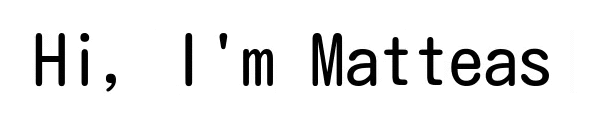
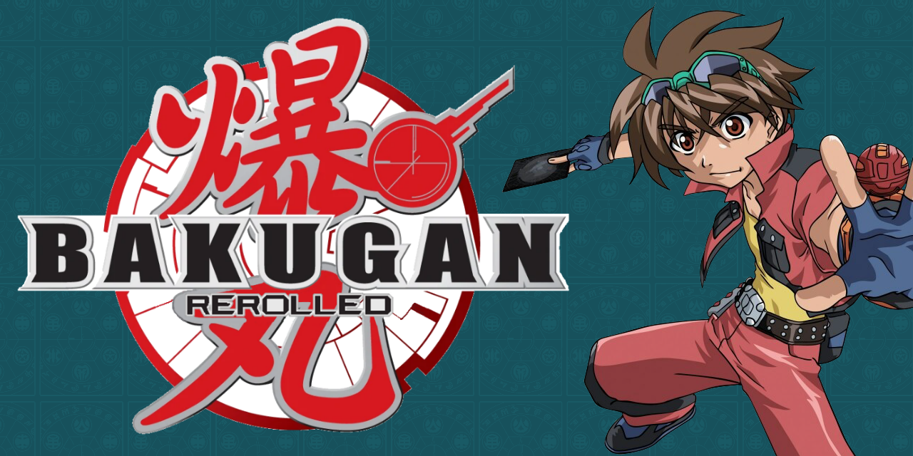
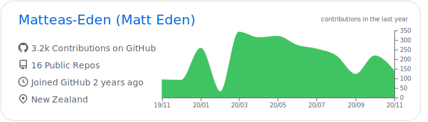
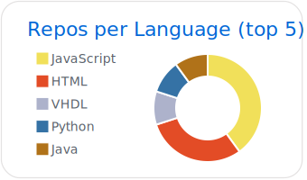
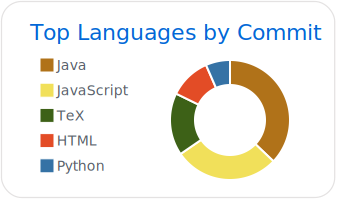
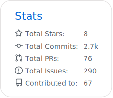

*Software Developer, Computer Engineer and Linux Enthusiast*

## 

I'm Matt 'Matteas' Eden, a New Zealand based computer enthusiast currently starting
my career in software engineering and development. My interests include web development, graphics cards and everything in between. When not at my computer, I can be found at the dojo (道場), training in Goju-Ryu Karate (剛柔流空手道).
Currently a green belt (5th Kyu), but I'll get to black belt someday!

## 

  
  

## 

  
  
  

