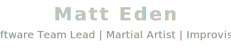

<!-- Bavro for the header -->
<!-- 

  <h1>Matt Eden</h1>

 -->

  

🇯🇵 [日本語版](https://matteden.nz) 🇯🇵

<!-- Penna for the section headings -->
<!-- Not sure about the Japanese - is that stil important to include? -->

## About Me / 私について

I'm cool some of the time all of the time.

Here's some stuff about me:
- I'm a person
- I have an internet connection
- I have a github account

More text here

## Projects / プロジェクト

### Cool Project #1 - A really cool project [2024]

 

  

    Look at the [code](https://github.com/Matteas-Eden/Matteas-Eden)
  

---

This is another cool project I did once.

Look at the [code](https://github.com/Matteas-Eden/Matteas-Eden)

---

## Connect / 繋ぎましょう

Reach out on LinkedIn.
