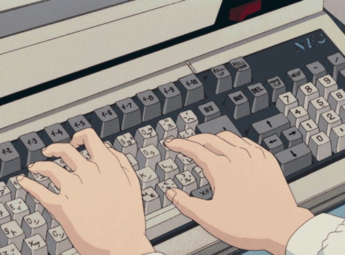
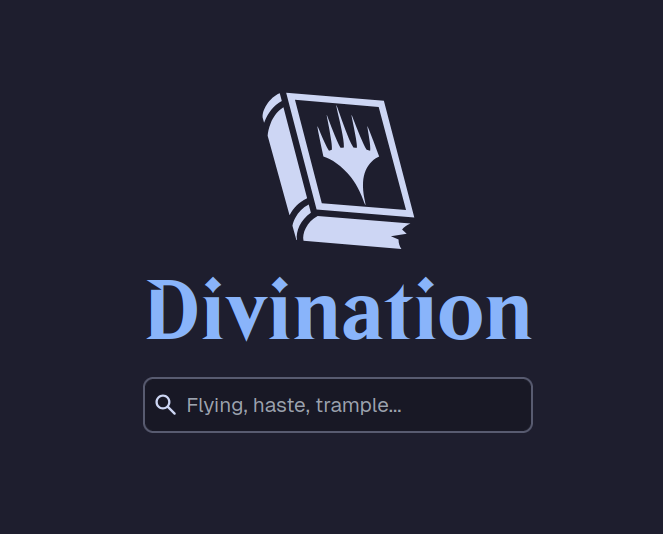
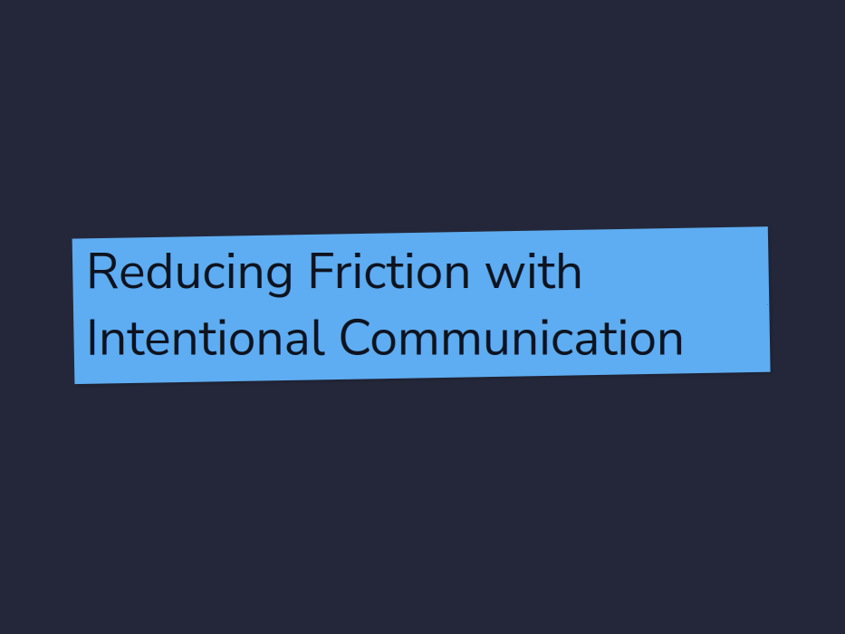
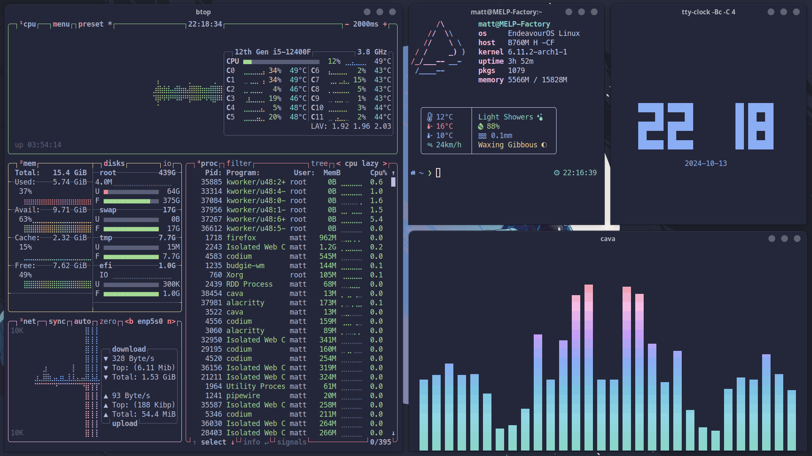
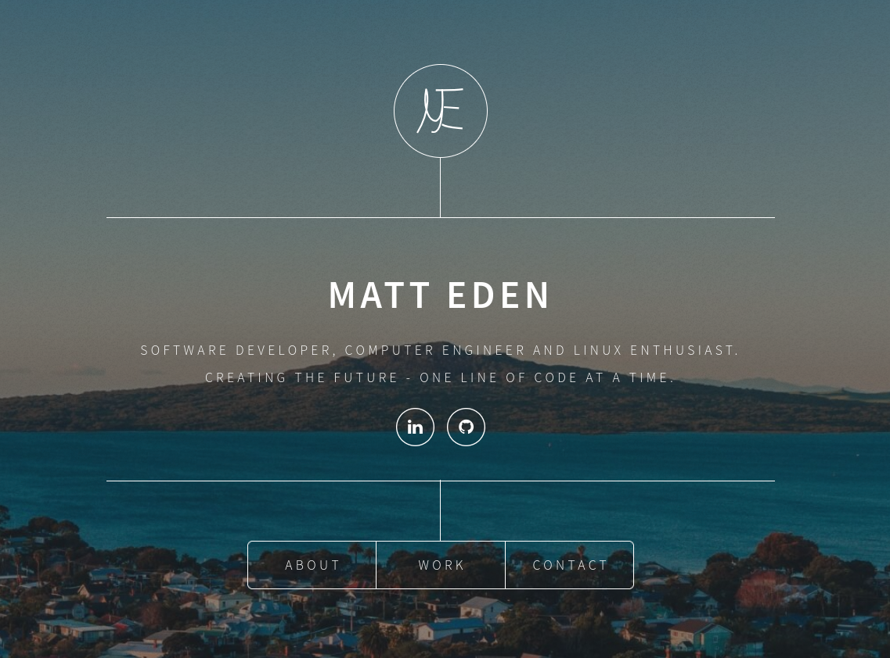
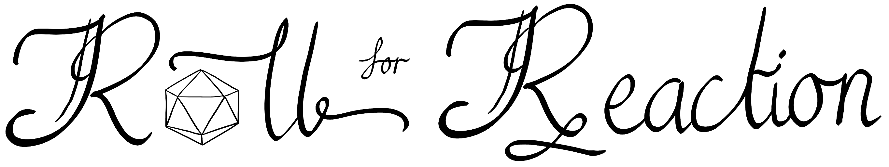
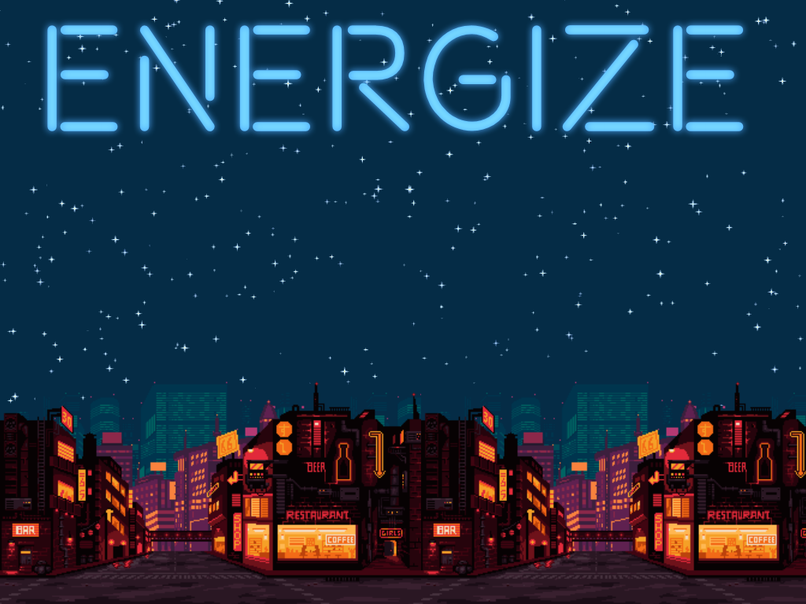
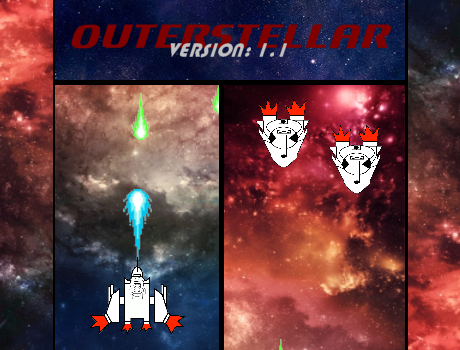
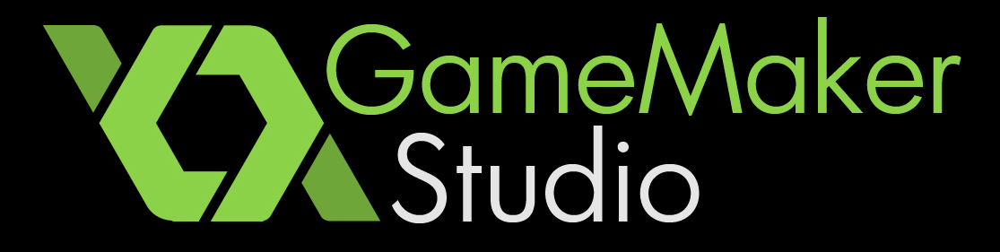

  <picture>
    <source media="(prefers-color-scheme: dark)" srcset="assets/headings/profile-header.dark.svg">
    
  </picture>

<!-- ## About Me / 私について -->
<h2>
  <picture>
    <source media="(prefers-color-scheme: dark)" srcset="assets/headings/about-me.dark.svg">
    
  </picture>
</h2>

Hey, I'm Matt. Welcome to my profile!

Lately, I've been working on:

- Streamlining project delivery 📈
- Getting into better shape 🏃
- Improving my Japanese 🇯🇵

Take a look around, and feel free to reach out!

<!-- ## Projects / プロジェクト -->
<h2>
  <picture>
    <source media="(prefers-color-scheme: dark)" srcset="assets/headings/projects.dark.svg">
    
  </picture>
</h2>

### Divination [2025]

  

A website to easily search the comprehensive rules for Magic: The Gathering. Magic is hard, and this makes it easier.

Start searching the rules today at [divination.nz](https://divination.nz).

---

### Reducing Friction with Intentional Communication - JuniorDev Meetup Talk [2024]

  

A talk about how to improve our communication to make our everyday lives easier. My first talk at JuniorDev.

Check out the slides for the talk at [rfic.matteden.nz](https://rfic.matteden.nz).

---

<!-- 

### Desktop Linux Config - My Dotfiles [2024]

  

My Linux desktop, running on EndeavourOS with Budgie desktop. Themed with Catppuccin.

Check out the full setup at [dotfiles](https://github.com/Matteas-Eden/dotfiles).

--- -->

### matteden.nz - My Website [2022]

  

A simple portfolio website with an elegant design. Self-hosted on my own Kubernetes cluster.

Check it out at [matteden.nz](https://matteden.nz).

---

<picture>
  <source media="(prefers-color-scheme: dark)" srcset="assets/images/RollForReactionTitleWhite.png">
  
</picture>

### Roll for Reaction - Action Adventure RPG [2020]

 

A role-playing game I worked on during my degree. Heavily inspired by Dungeons and Dragons.

Hosted online, you can [play directly in your browser](https://matteas.nz/roll-for-reaction/).

---

### Energize - Action Adventure Side-Scroller [2019]

 <b>JavaFX</b>

A Legend of Zelda clone I worked on during my degree. Voted best game in the class.

Check it out at [Energize](https://github.com/Matteas-Eden/Energize).

---

### Outerstellar - Top-down Arcade Shooter [2016]

The game I made in my first ever hackathon. Developed over 5 days and won 2nd place.

Although the source code was lost to time, the [installer survived](https://github.com/Matteas-Eden/outerstellar/releases).

<!-- ## Connect / 繋ぎましょう -->
<h2>
  <picture>
    <source media="(prefers-color-scheme: dark)" srcset="assets/headings/connect.dark.svg">
    
  </picture>
</h2>

 [Reach out to me on LinkedIn](https://www.linkedin.com/in/matteas-eden/)

✉️ [Contact me via my website](https://matteden.nz/contact)
