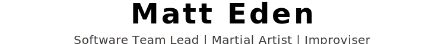
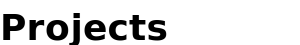
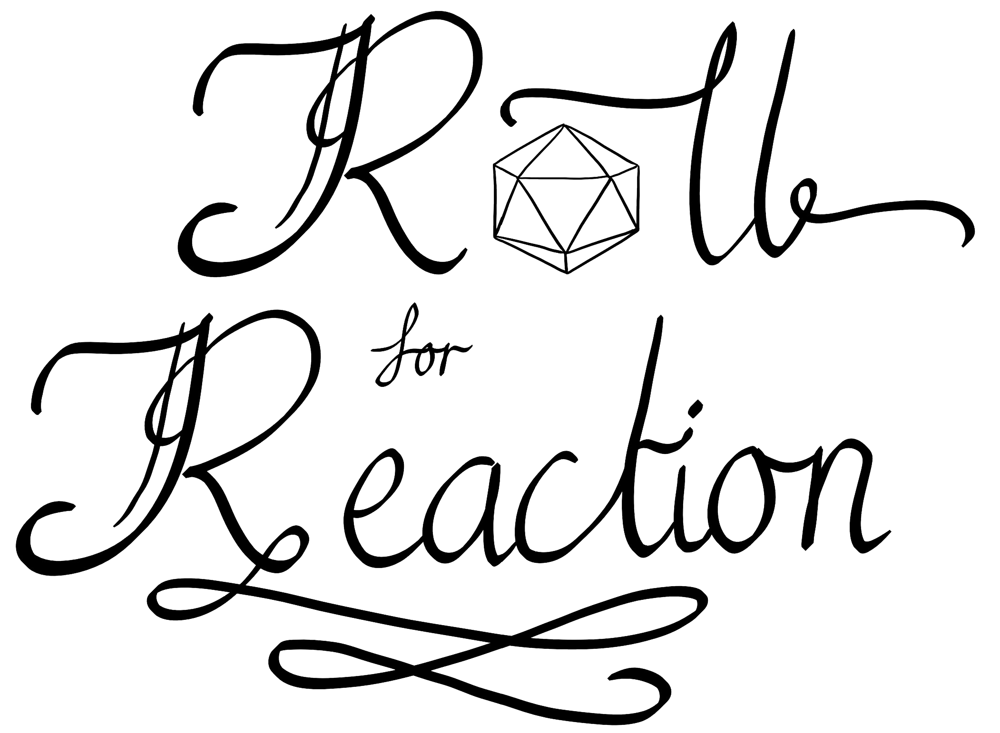

  <picture>
    <source media="(prefers-color-scheme: dark)" srcset="assets/headings/profile-header.dark.svg">
    
  </picture>

<!-- TODO: Update this linke -->
<!-- 🇯🇵 [日本語版](https://matteden.nz) 🇯🇵 -->
<!-- Not sure about the Japanese - is that stil important to include? -->

<!-- ## About Me / 私について -->
<h2>
  <picture>
    <source media="(prefers-color-scheme: dark)" srcset="assets/headings/about-me.dark.svg">
    
  </picture>
</h2>

I'm cool some of the time all of the time.

Here's some stuff about me:
- I'm a person
- I have an internet connection
- I have a github account

More text here

<!-- ## Projects / プロジェクト -->
<h2>
  <picture>
    <source media="(prefers-color-scheme: dark)" srcset="assets/headings/projects.dark.svg">
    
  </picture>
</h2>

### Desktop Linux Config - My Dotfiles [2024]

  

  

  My personal dotfiles for my Linux desktop, running on EndeavourOS with Budgie desktop. Themed with Catppuccin.

  Check out the full setup at [dotfiles](https://github.com/Matteas-Eden/dotfiles).
  

---

### matteden.nz - My Website [2022]

  

  

  A simple portfolio website with an elegant design. Self-hosted on my own Kubernetes cluster.

  Check it out at [matteden.nz](https://matteden.nz).
  

---

### Roll for Reaction - Action Adventure RPG [2020]

  

  

  A role-playing game I worked on during my degree. Heavily inspired by Dungeons and Dragons.

  Hosted online, you can [play directly in your browser](https://matteas.nz/roll-for-reaction/).
  

---

### Energize - Action Adventure Side-Scroller [2019]

 <b>JavaFX</b>

  

  A Legend of Zelda clone I worked on during my degree. Voted best game in the class.

  Check it out at [Energize](https://github.com/Matteas-Eden/Energize).
  

---

### Outerstellar - Top-down Arcade Shooter [2016]

  

The game I made in my first ever hackathon - took 5 days and got 2nd place.

Although the source code was lost to time, it can be still played using the [installer](https://github.com/Matteas-Eden/outerstellar/releases). 
  

<!-- ## Connect / 繋ぎましょう -->
<h2>
  <picture>
    <source media="(prefers-color-scheme: dark)" srcset="assets/headings/connect.dark.svg">
    
  </picture>
</h2>

 [Reach out to me on LinkedIn](https://www.linkedin.com/in/matteas-eden/)

✉️ [Contact me via my website](https://matteden.nz/contact)
